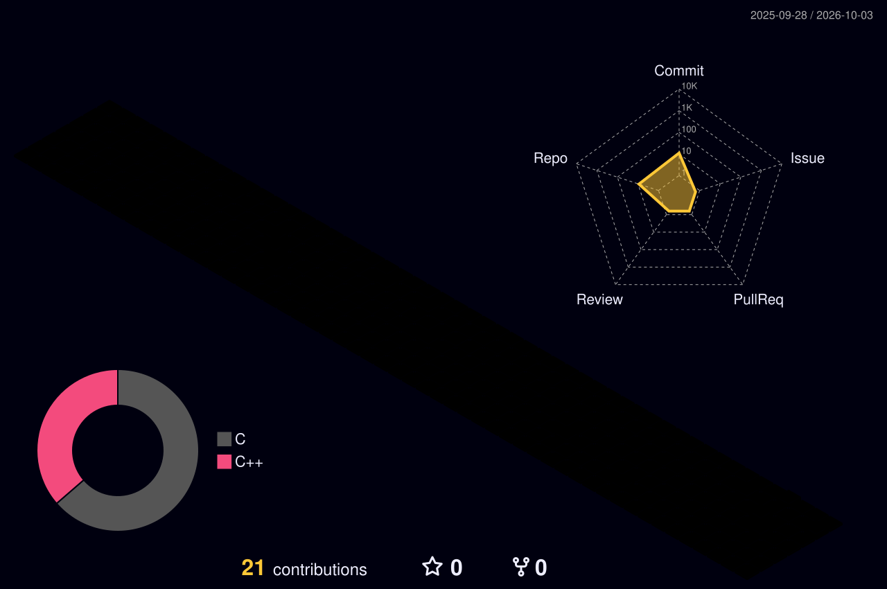

# Salut, moi c'est Alexy 👋

Étudiant à **42 Paris** 🇫🇷 — passionné par la programmation bas niveau, le C et le C++.

- 🔭 Je travaille actuellement sur le cursus commun de 42 (piscines C++, projets systèmes)
- 🌱 J'apprends le C++ moderne, les systèmes Unix et le réseau
- 📫 Me contacter : voir les liens ci-dessous

## 🛠️ Compétences

## 🚀 Projets

| Projet | Langage | Description |
|---|---|---|
| [Minishell](https://github.com/SupremeBarney/Minishell) | C | Un shell Unix minimaliste : parsing, pipes, redirections, variables d'environnement, builtins. |
| [push_swap](https://github.com/SupremeBarney/push_swap) | C | Trier une pile avec un jeu d'instructions limité, en un minimum de coups. |
| [minitalk](https://github.com/SupremeBarney/minitalk) | C | Communication client/serveur via les signaux Unix (`SIGUSR1` / `SIGUSR2`). |
| [get_next_line](https://github.com/SupremeBarney/get_next_line) | C | Lecture d'un file descriptor ligne par ligne, avec buffer et gestion mémoire. |
| [ft_printf](https://github.com/SupremeBarney/ft_printf) | C | Réimplémentation de `printf` : fonctions variadiques et formatage. |
| [libft](https://github.com/SupremeBarney/libft) | C | Ma propre bibliothèque C standard, réécrite from scratch. |
| [CPP-Module-00](https://github.com/SupremeBarney/CPP-Module-00) | C++ | Introduction à la POO : classes, constructeurs, encapsulation. |
| [CPP-Module-01](https://github.com/SupremeBarney/CPP-Module-01) | C++ | Allocation, pointeurs vs références, fichiers, pointeurs sur fonctions membres. |

## 📊 Statistiques

  
  

  

## 🧊 Contributions en 3D

  <picture>
    <source media="(prefers-color-scheme: dark)"  srcset="profile-3d-contrib/profile-night-rainbow.svg" width="700" />
    <source media="(prefers-color-scheme: light)" srcset="profile-3d-contrib/profile-season-animate.svg" width="700" />
    
  </picture>

## 📈 Métriques

  

## 🤝 Me retrouver

- [LinkedIn](https://www.linkedin.com/in/alexy-francois/)
- [Profil 42](https://profile.intra.42.fr/users/lfievet)
